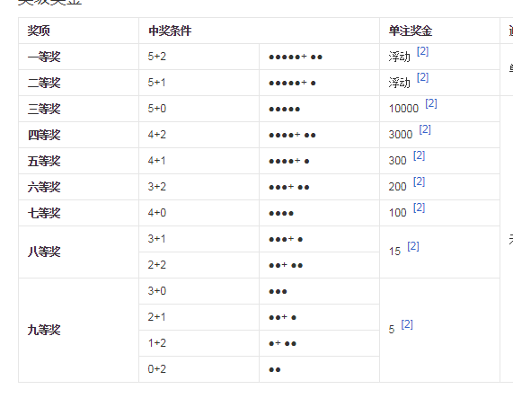
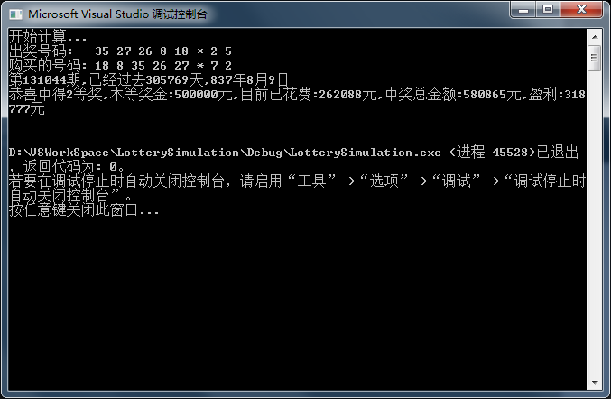

# LotterySimulation
模拟程序

如果你每一期购买一注彩票,那么多久之后能中得一注一等奖或者是二等奖呢?
---
有一次有了这个想法,并且刚学了c++,然后就试着用程序模拟了一下,该程序为纯命令框显示结果没有其他界面,可以选择显示每次中奖或者是中得一等奖或者二等奖才显示.

该彩票的规则如下:

 * 每个星期开三次奖
 * 每注两块钱
 * 彩票为大乐透,规则参照大乐透
 * 中得一等奖或者二等奖视为中大奖,并且设定一等奖一千万,二等奖五十万
 * 随机方式为机器随机,并且随机种子采用时间,也就是说不百分百随机
 * 前区号码35选5,后区号码12选2

大乐透规则如下图:

该代码研究方向为模拟随机购买一注要多久能中奖,不考虑现实情况或者规则有误的情况.

###结果示例:

 * 每三期一个星期,花费时间年月日为粗算,一年按照365天,月30天计算.
 * 目前已花费是指每注2块钱,一期一注
 * 中奖总金额是指,在本次一(或二)等奖和之前中得其他(3-9)等奖,中得的所有金额之和.
 * 盈利则为所赚取的钱,正值为赚取,负值为亏损.
  
 经过测试,运气好的话一百多年就中奖了,运气不好的话要三千多年到五千多年吧,看了结果,还是觉得老老实实搬砖吧.毕竟活不了那么长.

###代码说明

 * 初学c++,此项目为个人练习代码.
 * LotteryPaper为彩票类,存储了该期所购买的彩票
 * LotteryMachine为彩票机类,能出彩票.(或者是可以奖出一张彩票视为本次摇奖结果),也能验证彩票是否中奖,中了几等奖
 * Prize类为抽象类,该类是n等奖的抽象,具有判断是否符合该等奖的条件,还有该等奖的中奖金额. 该类目前有9个派生类,分别代表1-9等奖.

程序大概思路:每次彩票出两张,其中一张作为摇奖结果,一张作为自己购买的彩票,然后将两张进行比对,中奖则计入中奖总金额去(可在代码中去掉注释,立刻打印).

#####end